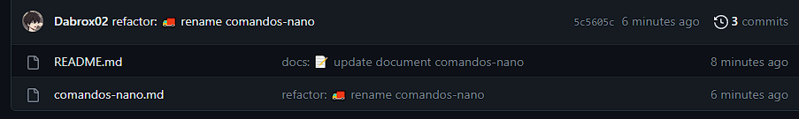

# GIT - CONVENTIONAL COMMITS
## GIT PRUEBA
Inicio de Prueba

- `git init`: Inicializacion del repositorio.
- `git add .`: Se agregan todos los cambios al Stage.
- `git commit --verbose"`: Abre el editor predeterminado para editar el commit.
- `git remote add origin https://github.com/Dabrox02/git-cli-pruebas.git`: Configuracion del repositorio remoto.
- `git push -u origin main`: Cambios al repositorio remoto.

## CONVENTIONAL COMMITS
Estructura de un *conventional commit*

`<tipo>[ámbito opcional]: :emoji: <descripción>`

### Ejemplo

#### Fuentes
- [Conventional Commits](conventionalcommits.org/en/v1.0.0/)
- [GitMoji](https://gitmoji.dev/)